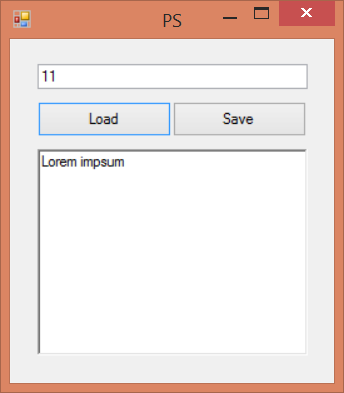
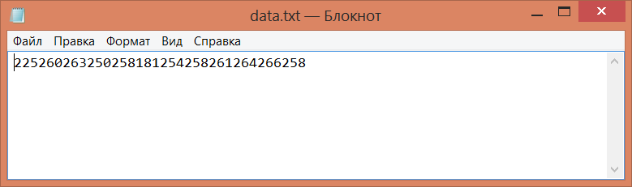

# encode-password

---
GUI	application that encode	our	passwords and store it in data.text. 

Application contains one textbox for Key and another textbox for data. 

Application also contains	two	buttons:	"Load"	and	"Save",	first	button	loads	 the	 data	from	data.txt
(if	it exists)	and	decode it with entered Key and "Save" encode data with entered Key and save	it to data.txt.

 
How	this application work - If was entered	Key	11 and Password	"Lorem impsum"	and	click on Save button

In the data.txt	file we have encoded password

